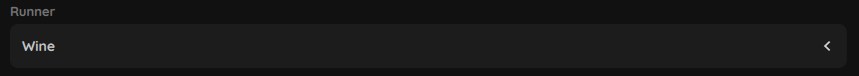
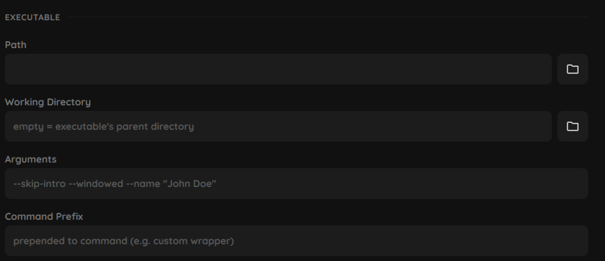
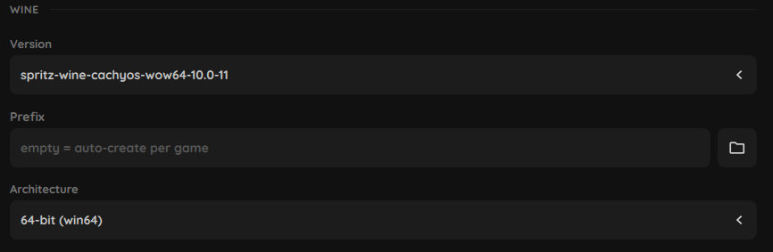
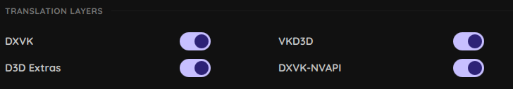
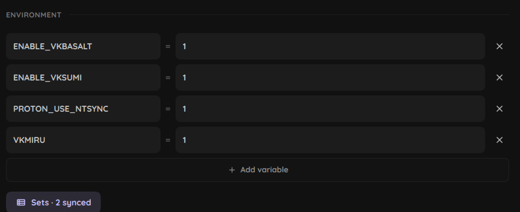
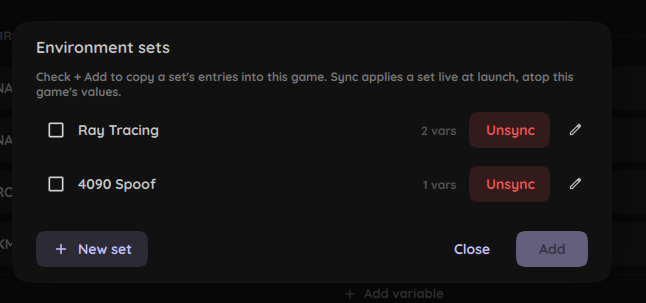
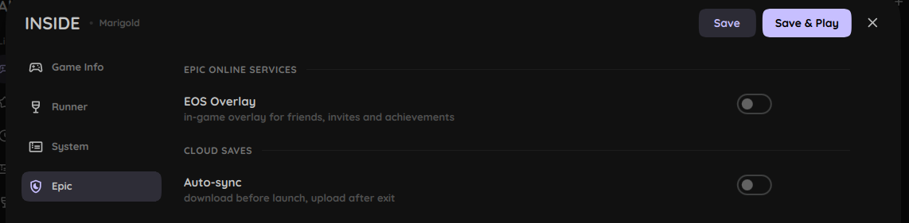

# Game settings

Per-game settings open from the library: right-click a game and pick Settings, or use the edit button or just add a new game. Changes are staged until you hit Save or Save & Play.

## Runner type

On the Game Info tab, the runner type decides how the game launches:

\- **Wine**: run a Windows game through wine or proton. The default for most things.

\- **Steam**: hand off to Steam, for imported Steam games.

\- **Native**: run a Linux binary directly, no wine.

\- **Flatpak**: launch an installed flatpak app.

The rest of Game Info (name, artwork, color) is optional and self-explanatory.

## Runner

Wine/proton config. Only shown for Wine games.

**Executable**

\- **Path**: the game's `.exe`.

\- **Working Directory**: where the process starts. Empty uses the exe's folder.

\- **Arguments**: passed to the game, e.g. `--skip-intro`, `-use-d3d12`.

\- **Command Prefix**: prepended to the whole launch command, for a custom wrapper.

**Wine**

\- **Version**: which wine/proton build to use.

\- **Prefix**: the wine prefix. Empty auto-creates a fresh one per game, the usual setup.

\- **Architecture**: 64- or 32-bit prefix.

**Translation Layers**

\- **DXVK**: Direct3D 9/10/11 to Vulkan.

\- **VKD3D**: Direct3D 12 to Vulkan.

\- **DXVK-NVAPI**: exposes NVIDIA features (DLSS, Reflex).

Toggling a layer here enables it for this game. The actual versions come from the DLL packs in Settings => Components, and the version picker lives in that panel.

**Display**: DPI Scaling plus a DPI slider.

**Drivers**: the wine Audio Driver (Default, PulseAudio, or ALSA).

**Graphics Driver**: X11/Wayland picker.

## System

**Performance**: GameMode (Feral's `gamemoderun`) and a CPU core limit.

**Display**: MangoHUD overlay and the GPU to run on. The GPU list comes from your installed Vulkan drivers, handy on multi-GPU setups to pin a game to the dGPU or iGPU.

**Gamescope**: runs the game inside Valve's gamescope compositor. Enabling it exposes output and game resolution, an FPS cap, fullscreen or borderless, integer scaling, and an upscaling filter (FSR, NIS, nearest, linear).

**Audio**: Reduce Pulse Latency.

**Power**: Prevent Sleep keeps the screen awake while the game runs.

**Environment**: env vars to use when launching a game.

**Sets**: Stored env vars that you can:

\- Sync (they will be used along the current game's ones. Synced ones are not added in the game settings, so, changing a synced set will apply to all games) 

\- Add (adding an env set will apply the contained vars to the game settings).

## Epic

Only appears for Epic games.

\- **EOS Overlay**: installs and enables the Epic Online Services overlay in the prefix.

\- **Cloud Saves**: Auto-sync pulls saves before launch and pushes them after exit. Save Path Override covers the case where the path isn't detected automatically. Note that it won't find the path if the game was never ran first.
