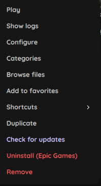
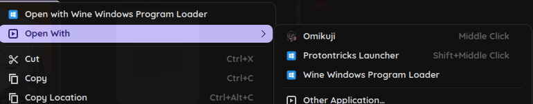
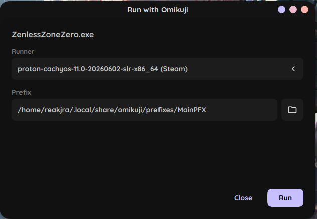

# Little Big Launcher

Oh, hello there. Are you lost? Don't you fret.

Come take a little tour through this page, silly and unimportant to the cold, indifferent universe as it may be, and I shall guide you through your very first steps. Together we'll coax one humble game into running. Today's brave volunteer is a noble title named `WizardGoose.exe`, though whatever game you happen to have will do just as nicely.

## A home for your game

Up in the top right of your little, adorable application window, there's a very calm `+` button. Give it a gentle press, and a window titled **New Game** drifts open.

This is where your game introduces itself:

\- A **Name**, so it has something to be called. Ours shall be "Wizard Goose".

\- A **Runner**, which is *how* it should run. Our goose is a Windows creature, so we leave it on **Wine**. A native Linux creature would prefer Native, a Steam import would prefer Steam, but those are tales for another day.

A name is all it truly needs to exist. The rest is just kindness.

## Dressing it up

Wander over to the **Runner** tab. Here live the knobs that teach a Windows game how to behave on Linux.

You needn't touch most of them. Three deserve a glance:

\- The **Path** to its `.exe`, the little file that actually starts the thing. Browse to wherever it lives on your disk.

\- **Version**: the wine or proton build it runs on. Choose one from the list. If the list is bare, slip into Settings and install a runner first, then come back.

\- **Prefix**: the little fake `C:` drive your game will call home. Leave it empty and omikuji quietly conjures a fresh one just for this game, which is exactly what you want.

Should your goose demand finer graphics, the **Translation Layers** section holds toggles like DXVK and VKD3D. Flick them on if it asks. Every last knob in here is catalogued, calmly and exhaustively, over in [Game settings](game-settings.md). For now, we keep things simple.

## The first flight

At the top wait two buttons. **Create** tucks the game safely into your library. **Create & Play** does the same, then sets it flying at once.

Press **Create & Play**.

And off it goes. Your goose takes wing. You did it.

Now go, back into the cold and indifferent universe, a little less lost than you were. Your library is right over there whenever you want it, and every game you bring home gets its own quiet little corner.

## But... but what if a third-world eldritch being offers me games...?

Oh... little summer dear. Don't you just worry. Look at your left, what do you see? Exactly. Four, cosmological creatures waiting for your interest. Let's try the first one. Click.

\- **Steam**: A religion, someone would say. It just shows you, doesn't it? A tiny, colored `+` awaits on each contemporary art. Click it. And it'll come home.

\- **Epic Games**: Loved by its generosity. Same as before, however, now you'll have to make your first choice. The installation path. Where do you want to keep the bloody membrane of this one? Choose carefully. Then, a prefix, just leave it empty. A runner. Of course. Once you made your life-bearing decisions, don't worry yet, it's gonna take just a moment. Click gently on the button at the bottom right, 'Install'. You won't believe what will happen.

\- **GOG**: I'm not gonna explain this one, you're grown enough. You already know how to do it.

\- **Gachas**: Oh dear. Now some more paths belie in front of us. But stay calm. Let your inner self tell you where do you feel the most and what voices you're hearing.

## What is this...? 

My, my. This is, in plain terms, a context menu. See? It's very simple to understand. But let's talk abotu some distinctive choices. 

\- **Check for updates**: This works for GOG and Epic Games. It's self explanatory, isn't it?

\- **Uninstall (Epic Games)**: Oh, this is *`unique`*. This, will help you delete a silly, naughty creature from your library and your disk. It's important to do this for this type of creatures, because they need extra implicit steps that sometimes, our life, won't ever tell us.

\- **Repair**: This... this one is healing a wound that sometimes life scars us with. This one, is *`unique`* too. It only applies on creatures from a very specific company.

## Is... is it infecting my digital life? 

Of course not, adorable creature. This one, helps you out when sometimes reaching for something important feels to heavy so you need something lighter to assist you.

See? 

Very minimal.
